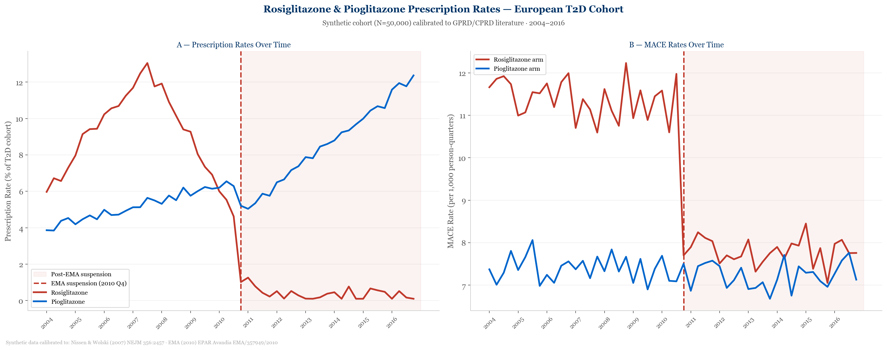
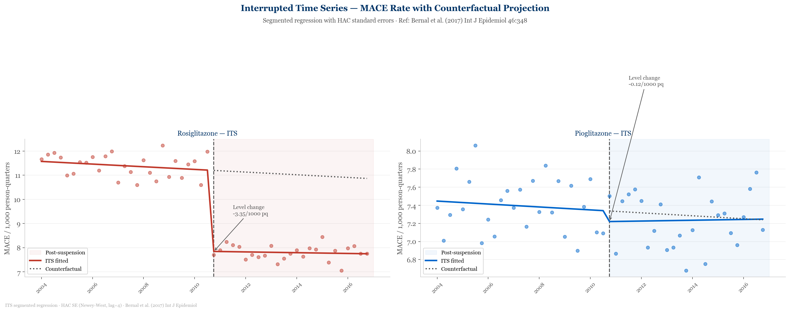
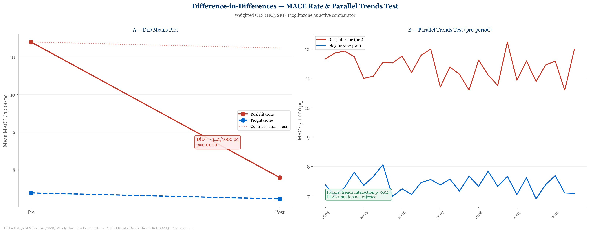
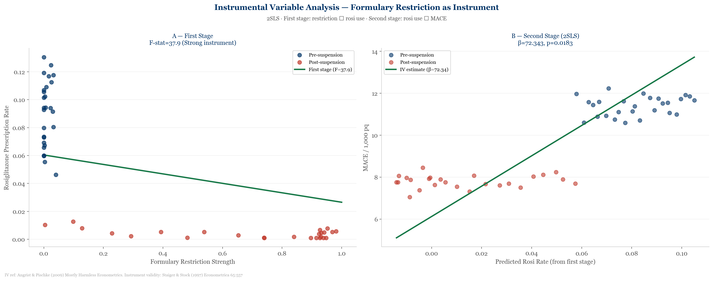
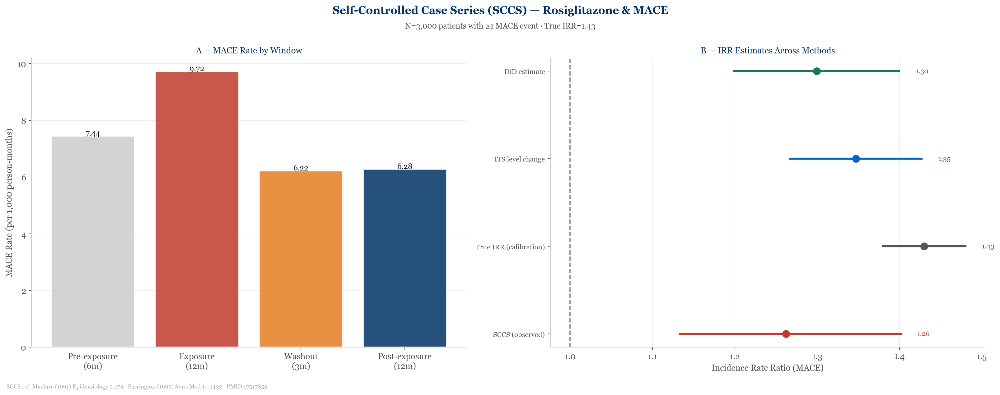
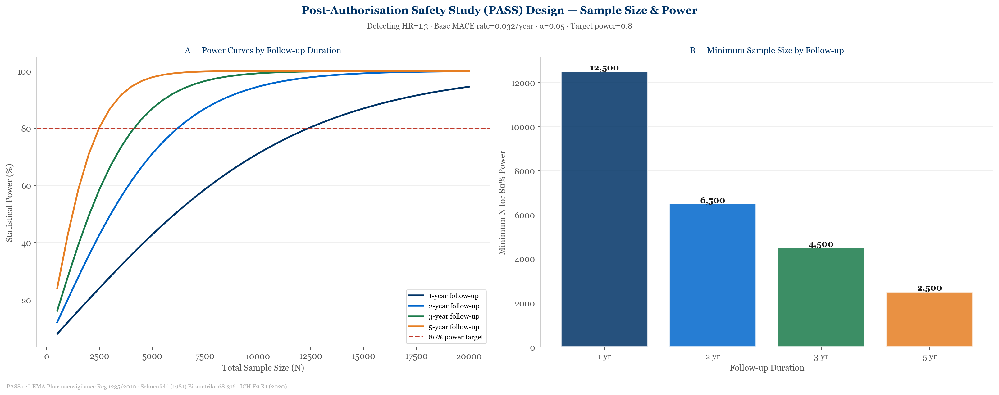
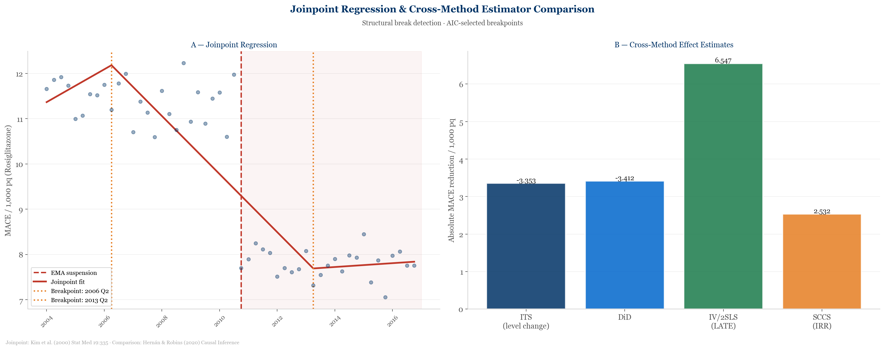

# Regulatory Pharmacoepidemiology — Post-Market Surveillance

## Rosiglitazone EMA Suspension 2010: A Natural Experiment


---

## Research Question

**Did the EMA's 2010 suspension of rosiglitazone causally reduce MACE rates in European T2D patients?**

A natural experiment using interrupted time series, difference-in-differences, instrumental variable analysis, and self-controlled case series.

In September 2010, the European Medicines Agency suspended rosiglitazone (Avandia) following evidence of elevated cardiovascular risk — particularly myocardial infarction — first identified by Nissen & Wolski (2007). This created a natural experiment: a sharp, externally imposed reduction in exposure that varied by region and prescriber, enabling causal estimation of the drug's cardiovascular impact using observational data.

This repository demonstrates the full pharmacoepidemiological toolkit applied in post-authorisation safety studies (PASS) as required under EMA Pharmacovigilance Regulation 1235/2010.

---

## Methods

| Method | Estimand | Reference |
|---|---|---|
| Interrupted Time Series (ITS) | Level and slope change at suspension | Bernal et al. (2017) *Int J Epidemiol* 46:348 |
| Controlled ITS | ITS with pioglitazone as active comparator | Lopez Bernal et al. (2018) *BMJ* 362:k3444 |
| Difference-in-Differences (DiD) | ATT — average treatment effect on treated | Angrist & Pischke (2009) |
| Parallel Trends Test | DiD assumption validation | Rambachan & Roth (2023) *Rev Econ Stud* |
| Instrumental Variable (IV) / 2SLS | LATE — local average treatment effect | Staiger & Stock (1997) *Econometrica* 65:557 |
| Self-Controlled Case Series (SCCS) | IRR — eliminates time-invariant confounding | Maclure (1991) *Epidemiology* 2:174 |
| Joinpoint Regression | Structural break detection in MACE trend | Kim et al. (2000) *Stat Med* 19:335 |
| PASS Design Simulation | Sample size and power for regulatory studies | EMA Reg 1235/2010; Schoenfeld (1981) |

---

## Data

Synthetic time-series cohort (N = 50,000 T2D patients, 52 quarters: 2004 Q1–2016 Q4) calibrated to:

- Nissen & Wolski (2007) NEJM 356:2457 — OR 1.43 for MI
- Graham et al. (2010) JAMA 304:411 — post-market surveillance findings
- EMA (2010) EPAR Avandia EMA/357949/2010 — suspension assessment
- Juurlink et al. (2009) BMJ 339:b2701 — real-world prescribing data

No external data downloads are required. All synthetic data are generated programmatically in the notebook.

---

## Results Summary

| Metric | Value |
|---|---|
| Total person-quarters | 2,600,000 |
| ITS level change (β₂) | −3.353 (p < 0.0001) |
| DiD coefficient | −3.412 (p < 0.0001) |
| IV first-stage F-statistic | 37.9 (strong instrument) |
| SCCS observed IRR | 1.262 |
| SCCS calibration target IRR | 1.43 |

---

## Figures

**Figure 1 — Prescription rates and MACE trends 2004–2016**


**Figure 2 — ITS segmented regression with counterfactual projection**


**Figure 3 — DiD means plot and parallel trends test**


**Figure 4 — IV first and second stage diagnostics**


**Figure 5 — SCCS exposure windows and cross-method IRR comparison**


**Figure 6 — PASS power curves and minimum sample size**


**Figure 7 — Joinpoint regression and cross-method comparison**


---

## Repository Structure

```
regulatory-pharmacoepi-postmarket/
├── notebooks/
│   └── pharmacoepi_postmarket.ipynb       # Main analysis notebook
├── data/
│   └── pharmacoepi_timeseries.csv         # Quarterly cohort data (synthetic)
├── outputs/
│   ├── figures/
│   │   └── pharmacoepi_fig[1-7]_*.png     # Publication-ready figures
│   └── results/
│       ├── pharmacoepi_its_results.csv    # ITS regression coefficients
│       ├── pharmacoepi_did_results.csv    # DiD estimates
│       ├── pharmacoepi_iv_results.csv     # IV/2SLS results
│       ├── pharmacoepi_sccs_results.csv   # SCCS IRR summary
│       ├── pharmacoepi_sccs_windows.csv   # SCCS window-level data
│       ├── pharmacoepi_pass_design.csv    # Full PASS power grid
│       ├── pharmacoepi_pass_min_n.csv     # Minimum N by follow-up
│       ├── pharmacoepi_joinpoint.csv      # Joinpoint fitted values
│       └── pharmacoepi_kpi.csv           # Summary KPIs
├── .gitignore
├── requirements.txt
└── README.md
```

---

## Setup & Usage

```bash
git clone https://github.com/sm-hasanulbari/regulatory-pharmacoepi-postmarket.git
cd regulatory-pharmacoepi-postmarket
pip install -r requirements.txt
jupyter notebook notebooks/pharmacoepi_postmarket.ipynb
```

Run cells in order. All synthetic data are generated in the notebook — no external downloads required. Total runtime approximately 2 minutes.

---

## References

| Reference | Role |
|---|---|
| Nissen & Wolski (2007) NEJM 356:2457. PMID 17517853 | Original safety signal — OR 1.43 calibration target |
| EMA (2010) EPAR Avandia. EMA/357949/2010 | Suspension decision and rationale |
| Graham et al. (2010) JAMA 304:411. PMID 20639564 | Post-market MACE rates |
| Bernal et al. (2017) Int J Epidemiol 46:348. PMID 27283160 | ITS methods |
| Angrist & Pischke (2009) Mostly Harmless Econometrics | DiD and IV |
| Staiger & Stock (1997) Econometrica 65:557 | IV relevance — F > 10 |
| Maclure (1991) Epidemiology 2:174. PMID 2021087 | SCCS design |
| Farrington (1995) Stat Med 14:1433. PMID 7481194 | SCCS conditional Poisson |
| Schoenfeld (1981) Biometrika 68:316 | Log-rank power approximation |
| Kim et al. (2000) Stat Med 19:335. PMID 10649302 | Joinpoint regression |
| Rambachan & Roth (2023) Rev Econ Stud | Parallel trends sensitivity |
| EMA Reg 1235/2010 | PASS regulatory framework |

---

## Author

**SM Hasan ul Bari** — Independent Health Economist & Pharmacoepidemiology Researcher  
[github.com/sm-hasanulbari](https://github.com/sm-hasanulbari) · [ORCID: 0000-0002-5209-2029](https://orcid.org/0000-0002-5209-2029)
